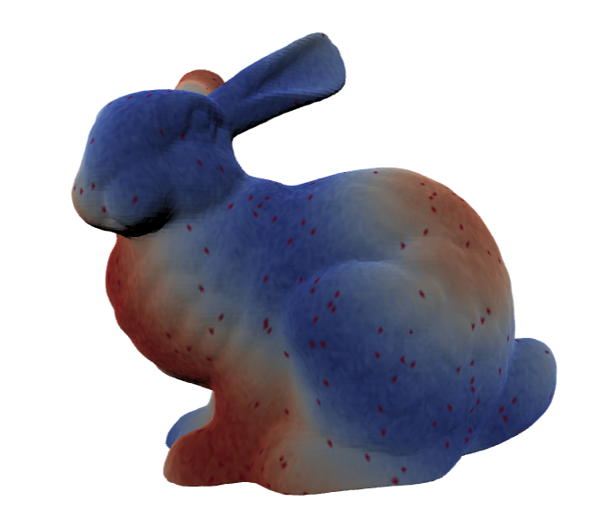
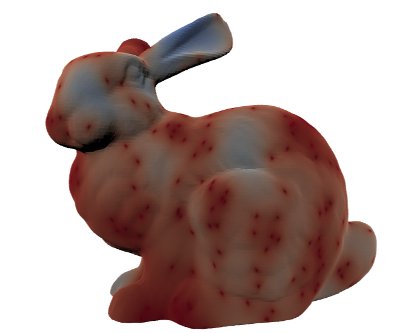

# Diffusion Equation Analysis on Stanford Bunny Mesh

This project is part of my Deep Learning Exam at the University of Trieste. It demonstrates the application of numerical analysis, graph deep learning, and diffusion equations on the Stanford Bunny dataset.

## Overview

You can open this notebook on [Google Colab](https://colab.research.google.com/) to experiment with the code and concepts covered here. The main topics include:

- **Numerical Analysis**
- **Graph Deep Learning**
- **Diffusion Equation**

The objective of this notebook is to merge some of the most exciting fields developed in recent years, such as Physics-Informed Artificial Intelligence and Geometric Deep Learning, through an application on the Stanford Bunny dataset.

## Features

- Analysis and visualization of the diffusion equation on a 3D mesh.
- Implementation of graph neural networks to solve the diffusion equation.
- Application of Differentiable Physics to enhance the solution.

## How to Use

1. Clone the repository:
   ```sh
   git clone https://github.com/YuriPaglierani/Diffusion_Equation_Analysis_Stanford_Bunny_Mesh.git
   cd your-repo

Or

2. Go directly to the Google Colab Notebook
   https://colab.research.google.com/drive/18ez55oVyQt2JFy5ibA1i4zcg8z3fCEjb?usp=sharing

## Things to Try
  Integrate Recurrent Neural Networks (RNNs) to improve temporal modeling.
  Compress the graph, iterate through the latent representation, and decompress when needed.
  Develop a framework for inverse problems, such as automatically estimating the diffusion coefficient 𝐷

  If you have any questions or suggestions, feel free to contact me on LinkedIn (Yuri Paglierani)

## Visualization

Below is an example of the Stanford Bunny mesh before and after applying the diffusion equation:

<div align="center">
  
  
  
</div>
  
